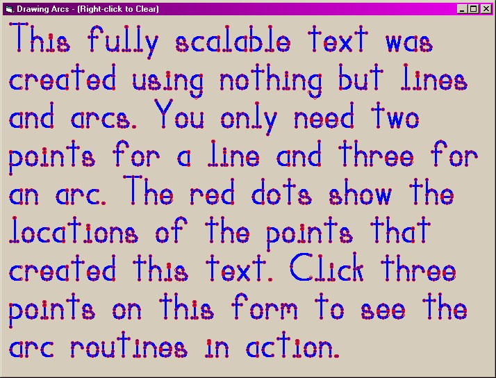



## Basic Geometry

### Description

Draw a perfect arc using any 3 given points. Find a point on a line at any given distance from the start point. Find the common point where 2 lines intersect. Find the distance between any 2 points. Get the angle of a line in degrees or radians. The list goes on. Sample program included. This module is an absolute must for graphics programmers.
 
### More Info
 

             |
---                |---
**Submitted On**   |2000-06-12 06:13:40
**By**             |[Rocky Clark \(Kath\-Rock Software\)](https://github.com/Planet-Source-Code/PSCIndex/blob/master/ByAuthor/rocky-clark-kath-rock-software.md)
**Level**          |Intermediate
**User Rating**    |5.0 (25 globes from 5 users)
**Compatibility**  |VB 5\.0, VB 6\.0
**Category**       |[Miscellaneous](https://github.com/Planet-Source-Code/PSCIndex/blob/master/ByCategory/miscellaneous__1-1.md)
**World**          |[Visual Basic](https://github.com/Planet-Source-Code/PSCIndex/blob/master/ByWorld/visual-basic.md)
**Archive File**   |[CODE\_UPLOAD66926122000\.zip](https://github.com/Planet-Source-Code/rocky-clark-kath-rock-software-basic-geometry__1-8849/archive/master.zip)

